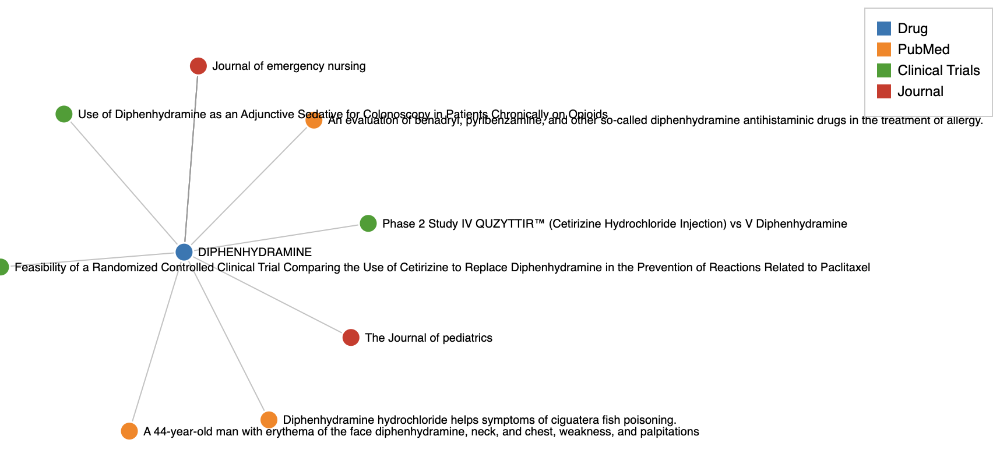

# For Servier : drug mention finder
 
Check it live on [Streamlit](https://drug-mentions-ktihvqxgbuay9lcvcystm3.streamlit.app/
)




Pre-requisits : 

- Python 3.11 (or compatible) installed
- Poetry installed (for dependency management)


This project processes drug mentions from three CSV files (clinical trials, drugs, PubMed) and outputs a JSON structure with all mentions. It also provides a Streamlit UI for uploading the CSVs and visualizing the resulting data in an interactive graph


## Installation
Clone the repo:

```
git clone git@github.com:zakariahajji/drug-mentions.git

cd drug-mentions
```

## Install dependencies with Poetry:

```
poetry install
```


## Directory structure:
```

    ├── README.md
    ├── app.py
    ├── pyproject.toml
    ├── src/
    │   ├── __init__.py
    │   ├── data/
    │   │   ├── input/
    │   │   │   ├── clinical_trials.csv
    │   │   │   ├── drugs.csv
    │   │   │   ├── pubmed.csv
    │   │   │   └── pubmed.json
    │   │   └── output/
    │   │       └── drug_mentions.json
    │   └── drug_mentions/
    │       ├── __init__.py
    │       ├── main.py
    │       ├── models/
    │       │   ├── __init__.py
    │       │   └── schema.py
    │       └── pipeline/
    │           ├── __init__.py
    │           ├── loader.py
    │           ├── transformer.py
    │           └── writer.py
    ├── tests/
    │   ├── test_loader.py
    │   ├── test_transformer.py
    │   └── test_writer.py
    └── utils/
        └── d3_viewer.py
        └── ad_hoc.ipynb
        └── example_dag.py
```


You can run the main pipeline by running : 


```
➜  drug-mentions git:(main) ✗ poetry run drug-mentions       

Drug Mention Finder
Loading drugs...
Loaded 7 drugs
Loading publications...
Loaded 21 publications
Finding drug mentions...
Found mentions for 7 drugs
Writing results...
Results written to /Users/zakaria/Development/solution/drug-mentions/src/data/output/drug_mentions.json
```


You can run tests y running : 

```
drug-mentions git:(main) poetry run pytest              

==================================================================================================== test session starts =====================================================================================================
platform darwin -- Python 3.11.5, pytest-7.4.4, pluggy-1.5.0
rootdir: /Users/zakaria/Development/solution/drug-mentions
collected 5 items                                                                                                                                                                                                            

tests/test_loader.py ..                                                                                                                                                                                                [ 40%]
tests/test_transformer.py ..                                                                                                                                                                                           [ 80%]
tests/test_writer.py .                                                                                                                                                                                                 [100%]

===================================================================================================== 5 passed in 0.30s ======================================================================================================

```


You can run the ad-hoc notebook script : 

```
Using JSON file: /Users/zakaria/Development/solution/drug-mentions/src/data/output/drug_mentions.json
Le journal qui mentionne le plus de médicaments différents est Psychopharmacology avec 2 médicaments différents : ['TETRACYCLINE', 'ETHANOL']
```


## Commentaires et réponses

Le code est organisé de manière modulaire en séparant clairement les étapes clés du pipeline (Loader, transformation et Writer). Cela permet de réutiliser certaines étapes dans d'autres pipelines de données. De plus, la structure a été conçue pour être facilement intégrée dans un orchestrateur(comme un [DAG Airflow](utils/example_dag.py)), On peut ainsi personaliser chaque module pour faire le job selon le service orchestré.
Personalisations possibles selon le context : 

    ( Loader et transformer > Partitionner et distribuer le calcul (Spark : aws:EMR/gcp:DataProc) , ou DBT/BigQuery

    (Writer : Ca dépend des use-cases, OLTP/NoSQL > Applicatif OU BI et Analytics/OLAP : Datawarehouse ( Bigquery...))


  - Q : Quels sont les éléments à considérer pour faire évoluer votre code afin qu’il puisse gérer de grosses
  volumétries de données (fichiers de plusieurs To ou millions de fichiers par exemple) ?
  Pourriez-vous décrire les modifications qu’il faudrait apporter, s’il y en a, pour prendre en considération de
  telles volumétries ?

  - R : Parallélisation et distribution :
  il faut repenser l’architecture en décomposant le pipeline en tâches indépendantes et parallélisables, par exemple en microservices ou jobs orchestrés. Chaque étape (chargement, transformation, écriture) doit être isolée et capable de traiter des partitions de données en parallèle, ce qui réduit l’empreinte mémoire et accélère le traitement

    l’utilisation d’un outil distribué tel que Spark est idéale. Spark permet de traiter d’importants volumes de données grâce à son moteur en mémoire, sa capacité à partitionner les données sur un cluster et à paralléliser les calculs sur plusieurs nœuds. Cela simplifie l’évolution vers des architectures scalables et robust pour des volumes de plusieurs To ou millions de fichiers.


  

    
## Réponses Partie SQL :

1 - 

```
SELECT 
  DATE(date) AS date,
  SUM(prod_price * prod_qty) AS ventes
FROM `playground-playground-dev.servier_home.TRANSACTIONS`
WHERE DATE(date) BETWEEN '2019-01-01' AND '2019-12-31'
GROUP BY date
ORDER BY date ASC;
```


2 -

```
SELECT 
  t.client_id,
  SUM(CASE 
    WHEN pn.product_type = 'MEUBLE' THEN t.prod_price * t.prod_qty 
    ELSE 0 
  END) AS ventes_meuble,
  SUM(CASE 
    WHEN pn.product_type = 'DECO' THEN t.prod_price * t.prod_qty 
    ELSE 0 
  END) AS ventes_deco
FROM `playground-playground-dev.servier_home.TRANSACTIONS` t
INNER JOIN `playground-playground-dev.servier_home.PRODUCT_NOMENCLATURE` pn
  ON t.prod_id = pn.product_id
WHERE DATE(t.date) BETWEEN '2019-01-01' AND '2019-12-31'
GROUP BY t.client_id
ORDER BY t.client_id;
```